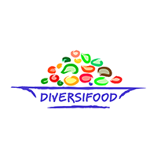

## DIVERSIFOOD - high quality food system

www.diversifood.eu

blablabla

## WP2

You can filter on five items :

- Country
- Partner
- Species
- Genetic structure
- Entry

In the table, the following descriptors are given:

|Column name| descriptions |
|---|---|
| Origin	| Where did you take the seeds |
| Where has it been tested | Location, experimental conditions |
| How has it been tested |	How many years? Experimental design? |
| Plant Descriptors	| MAIN Distinctive characteristics assessed (height, colours, shape, etc…) |
| Agroecosystem performance	| MAIN Indicators during crop growth assessed (cover, weeds, diseases, etc..) |
| Yield performance	| Yield indicators assessed (grain yield, yield components, etc.) |
| Quality performance	| Processing, Organoleptic, Nutritional, Nutraceutical analyses done |
| Overall comments	| How did it perform overall? |
| Further notes	|

 This project received funding from the European Union's Horizon 2020 Research and Innovation program under Grant Agreement n° 633571

